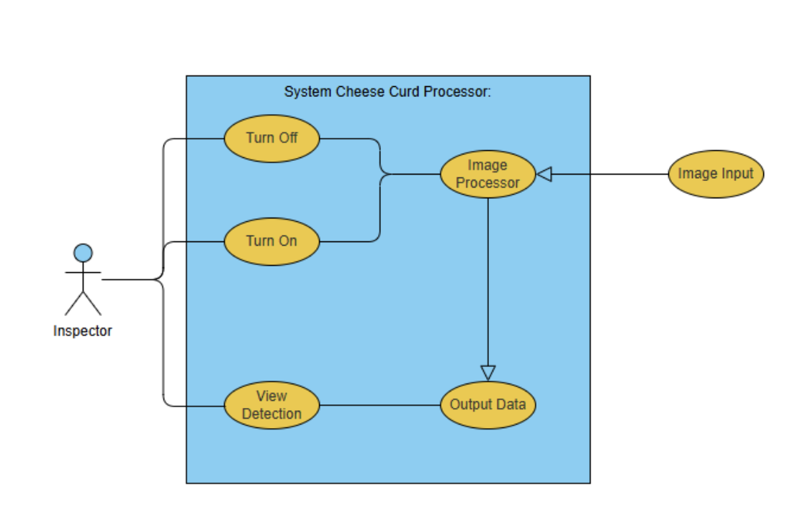
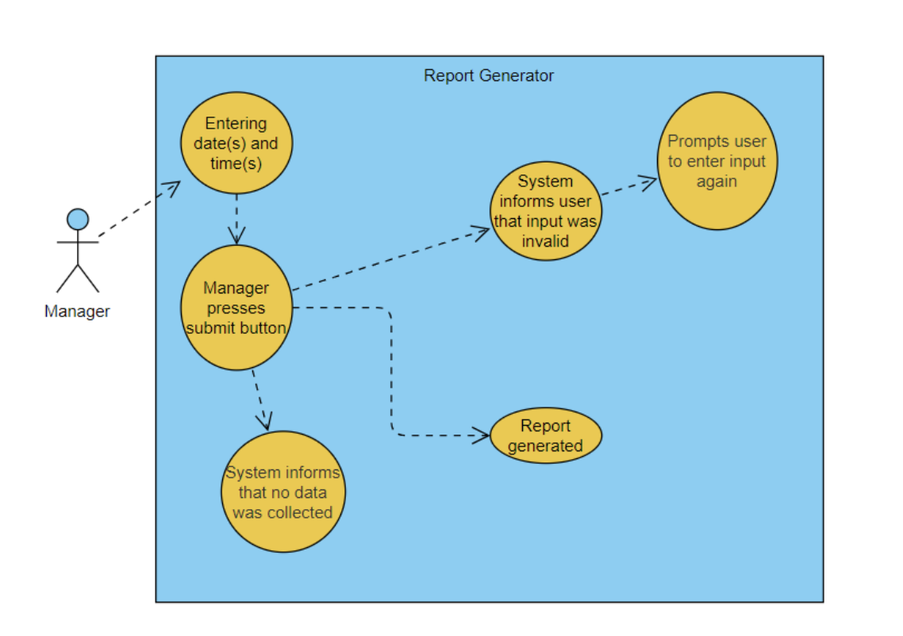
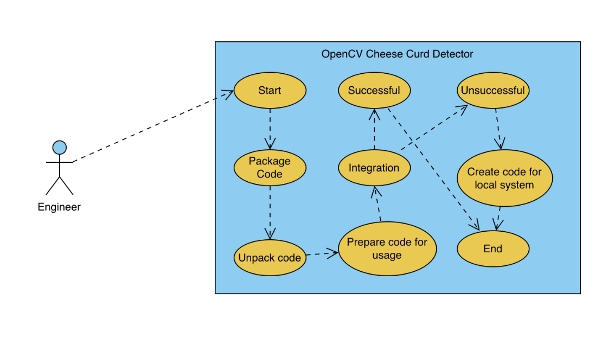

# Hilmar-Leak-Detection
Use Case 1:
================
Cheese Quality Inspector: 

Entry Conditions: Cheese is being produced, Cheese curd detection system has been activated
Exit Conditions: Turns off system via button

Basic flow:
Application startup: The inspector turns on the cheese curd detection application.
Image processing begins: The system starts processing images of cheese seals.
Cheese curd detected: The system identifies a cheese curd within a seal.
Notification triggered: A notification is sent to a front-end window, alerting the inspector.
Inspector investigates: The inspector investigates the detected cheese curd.
Defect identified: If the cheese curd is confirmed as a defect, the inspector takes appropriate action (e.g., reject the cheese, adjust production parameters).

Alternative flows:
Incorrect Results: Inspector dismisses the result.
No Defect found: Inspector continues waiting for an alert.

Inspector Use Case Diagram: 

Use Case 2:
================
Product Manager: 

Entry Conditions: Entering data and time of the data collected. 
Exit Conditions: Manager gets a report generated based on previous data.

Basic flow: 
Application startup: The inspector turns on the cheese curd detection application.
Manager enters time stamp(s): The manager enters the dates and times of data collected on those days.
Submission: Manager presses submit when all info is inserted.
Reports generated: The application generates a data report based on the input entered by the manager. 

Alternative flows:
No data found: No data is found for the date(s) and time(s) entered by the manager. Application informs the user that no data was found for that time.
Input validation: Manager enters data/time in an incorrect format and the system prompts for the user to try again and enter valid input (i.e. date or time out of range)

Manager Use Case Diagram:

Use Case 3:
================
Engineer:

Entry Conditions: When the software detects a potential curd, the system will show the user image of the cheese block at fault and highlight potential curd.
Exit Conditions: After verifying if there was a curd or not, move onto the next potential curd. 

Basic flow:
Software startup: After developing all the code, either package up the code or send the GitHub with start up instructions.
Software development: once unpacked, code can then be used for Hilmar's purposes.
Software integration: Hilmar integrates the code with their current software system for the camera. 

Alternative flows:
Software integration: if code written by the team doesn’t integrate with the Hilmar system, create code for the local system. 

Engineer Use Case Diagram   

